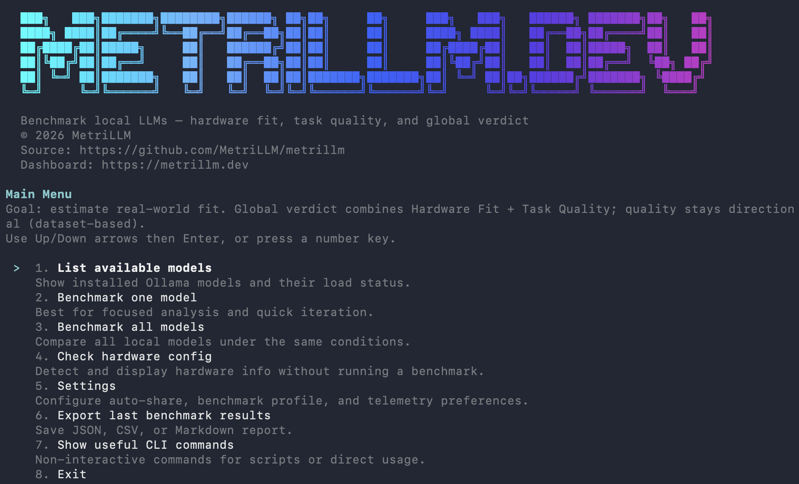
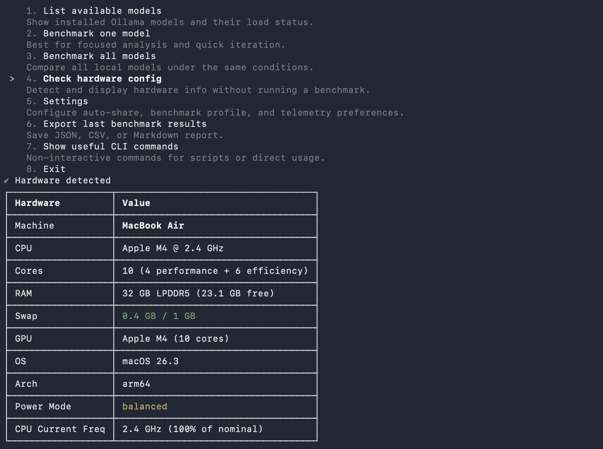

# MetriLLM

[](https://github.com/MetriLLM/metrillm/actions/workflows/ci.yml)
[](https://nodejs.org/)
[](LICENSE)

[](https://www.npmjs.com/package/metrillm)
[](https://www.npmjs.com/package/metrillm)
[](https://github.com/MetriLLM/metrillm)

**Benchmark your local LLM models in one command.** Speed, quality, hardware fitness — with a shareable score and public leaderboard.

> Think Geekbench, but for local LLMs on your actual hardware.

```bash
npm install -g metrillm
metrillm bench
```

<p align="center">
  
  
</p>

[](https://metrillm.dev)

## What You Get

- **Performance metrics**: tokens/sec, time to first token, memory usage, load time
- **Quality evaluation**: reasoning, coding, math, instruction following, structured output, multilingual (14 prompts, 6 categories)
- **Global score** (0-100): 30% hardware fit + 70% quality
- **Verdict**: EXCELLENT / GOOD / MARGINAL / NOT RECOMMENDED
- **One-click share**: `--share` uploads your result and gives you a public URL + leaderboard rank

## Real Benchmark Results

> From the [public leaderboard](https://metrillm.dev) — all results below were submitted with `metrillm bench --share`.

| Model | Machine | CPU | RAM | tok/s | TTFT | Global | Verdict |
|-------|---------|-----|-----|------:|-----:|-------:|---------|
| llama3.2:latest | Mac Mini | Apple M4 Pro | 64 GB | 98.9 | 125 ms | 77 | GOOD |
| mistral:latest | Mac Mini | Apple M4 Pro | 64 GB | 54.3 | 124 ms | 76 | GOOD |
| gemma3:4b | MacBook Air | Apple M4 | 32 GB | 35.9 | 303 ms | 72 | GOOD |
| gemma3:1b | MacBook Air | Apple M4 | 32 GB | 39.4 | 362 ms | 72 | GOOD |
| qwen3:1.7b | MacBook Air | Apple M4 | 32 GB | 37.9 | 3.1 s | 70 | GOOD |
| llama3.2:3b | MacBook Air | Apple M4 | 32 GB | 27.8 | 285 ms | 69 | GOOD |
| gemma3:12b | MacBook Air | Apple M4 | 32 GB | 12.3 | 656 ms | 67 | GOOD |
| phi4:14b | MacBook Air | Apple M4 | 32 GB | 11.1 | 515 ms | 65 | GOOD |
| mistral:7b | MacBook Air | Apple M4 | 32 GB | 13.6 | 517 ms | 61 | GOOD |
| deepseek-r1:14b | MacBook Air | Apple M4 | 32 GB | 10.8 | 30.0 s | 25 | NOT RECOMMENDED |

**Key takeaway**: Small models (1-4B) fly on Apple Silicon. Larger models (14B+) with thinking chains can choke even on capable hardware. [See full leaderboard &rarr;](https://metrillm.dev)

## Install

> Requires [Node 20+](https://nodejs.org/) and a local runtime:
> [Ollama](https://ollama.com/) or [LM Studio](https://lmstudio.ai/).

```bash
# Install globally
npm install -g metrillm
metrillm bench

# Alternative package managers
pnpm add -g metrillm
bun add -g metrillm

# Homebrew
brew install MetriLLM/metrillm/metrillm

# Or run without installing
npx metrillm@latest bench
```

## Usage

```bash
# Interactive mode — pick models from a menu
metrillm bench

# Benchmark a specific model
metrillm bench --model gemma3:4b

# Benchmark with LM Studio backend
metrillm bench --backend lm-studio --model qwen3-8b

# Benchmark all installed models
metrillm bench --all

# Share your result (upload + public URL + leaderboard rank)
metrillm bench --share

# CI/non-interactive mode
metrillm bench --ci-no-menu --share

# Force unload after each model (useful for memory isolation)
metrillm bench --all --unload-after-bench

# Export results locally
metrillm bench --export json
metrillm bench --export csv
```

## Upload Configuration (CLI + MCP)

By default, production builds upload shared results to the official MetriLLM leaderboard (`https://metrillm.dev`).

- No CI secret injection is required for standard releases.
- Local/dev runs use the same default behavior.
- Self-hosted or staging deployments can override endpoints with:
  - `METRILLM_SUPABASE_URL`
  - `METRILLM_SUPABASE_ANON_KEY`
  - `METRILLM_PUBLIC_RESULT_BASE_URL`

If these variables are set to placeholder values (from templates), MetriLLM falls back to official defaults.

## Windows Users

PowerShell's default execution policy blocks npm global scripts. If you see `PSSecurityException` or `UnauthorizedAccess` when running `metrillm`, run this once:

```powershell
Set-ExecutionPolicy -Scope CurrentUser -ExecutionPolicy RemoteSigned
```

Alternatively, use `npx metrillm` which bypasses the issue entirely.

## Runtime Backends

| Backend | Flag | Default URL | Required env |
|---|---|---|---|
| Ollama | `--backend ollama` | `http://127.0.0.1:11434` | `OLLAMA_HOST` (optional) |
| LM Studio | `--backend lm-studio` | `http://127.0.0.1:1234` | `LM_STUDIO_BASE_URL` (optional), `LM_STUDIO_API_KEY` (optional), `LM_STUDIO_STREAM_STALL_TIMEOUT_MS` (optional) |

For very large models, tune timeout flags:
- `--perf-warmup-timeout-ms` (default `300000`)
- `--perf-prompt-timeout-ms` (default `120000`)
- `--quality-timeout-ms` (default `120000`)
- `--coding-timeout-ms` (default `240000`)
- `--lm-studio-stream-stall-timeout-ms` (default `180000`, `0` disables stall timeout)

Benchmark Profile v1 (applied to all benchmark prompts):
- `temperature=0`
- `top_p=1`
- `seed=42`
- `thinking` follows your benchmark mode (`--thinking` / `--no-thinking`)
- Context window stays runtime default (`context=runtime-default`) and is recorded as such in metadata.

LM Studio non-thinking guard:
- When benchmark mode requests non-thinking (`--no-thinking` or default), MetriLLM now aborts if the model still emits reasoning traces (for result comparability).
- To disable it in LM Studio for affected models, put this at the top of the model chat template: `` then eject/reload the model.

## How Scoring Works

**Hardware Fit Score** (0-100) — how well the model runs on your machine:
- Speed: 50% (tokens/sec relative to your hardware tier)
- TTFT: 20% (time to first token)
- Memory: 30% (RAM efficiency)

**Quality Score** (0-100) — how well the model answers:
- Reasoning: 20pts | Coding: 20pts | Instruction Following: 20pts
- Structured Output: 15pts | Math: 15pts | Multilingual: 10pts

**Global Score** = 30% Hardware Fit + 70% Quality

Hardware is auto-detected and scoring adapts to your tier (Entry/Balanced/High-End). A model hitting 10 tok/s on a 8GB machine scores differently than on a 64GB rig.

[Full methodology &rarr;](https://metrillm.dev/methodology)

## Share Your Results

Every benchmark you share enriches the [public leaderboard](https://metrillm.dev). No account needed — pick the method that fits your workflow:

| Method | Command / Action | Best for |
|--------|-----------------|----------|
| **CLI** | `metrillm bench --share` | Terminal users |
| **MCP** | Call `share_result` tool | AI coding assistants |
| **Plugin** | `/benchmark` skill with share option | Claude Code / Cursor |

All methods produce the same result:
- A **public URL** for your benchmark
- Your **rank**: "Top X% globally, Top Y% on [your CPU]"
- A **share card** for social media
- A **challenge link** to send to friends

[Compare your results on the leaderboard &rarr;](https://metrillm.dev)

## MCP Server

Use MetriLLM from Claude Code, Cursor, Windsurf, or any MCP client — no CLI needed.

```bash
# Claude Code
claude mcp add metrillm -- npx metrillm-mcp@latest

# Claude Desktop / Cursor / Windsurf — add to MCP config:
# { "command": "npx", "args": ["metrillm-mcp@latest"] }
```

| Tool | Description |
|------|-------------|
| `list_models` | List locally available LLM models |
| `run_benchmark` | Run full benchmark (performance + quality) on a model |
| `get_results` | Retrieve previous benchmark results |
| `share_result` | Upload a result to the public leaderboard |

[Full MCP documentation &rarr;](mcp/README.md)

## Skills

Slash commands that work inside AI coding assistants — no server needed, just a Markdown file.

| Skill | Trigger | Description |
|-------|---------|-------------|
| `/benchmark` | User-invoked | Run a full benchmark interactively |
| `metrillm-guide` | Auto-invoked | Contextual guidance on model selection and results |

Skills are included in the [plugins](#plugins) below, or can be installed standalone:

```bash
# Claude Code
cp -r plugins/claude-code/skills/* ~/.claude/skills/

# Cursor
cp -r plugins/cursor/skills/* ~/.cursor/skills/
```

## Plugins

Pre-built bundles (MCP + skills + agents) for deeper IDE integration.

| Component | Description |
|-----------|-------------|
| MCP config | Auto-connects to `metrillm-mcp` server |
| Skills | `/benchmark` + `metrillm-guide` |
| Agent | `benchmark-advisor` — analyzes your hardware and recommends models |

**Install:**
```bash
# Claude Code
cp -r plugins/claude-code/.claude/* ~/.claude/

# Cursor
cp -r plugins/cursor/.cursor/* ~/.cursor/
```

See [Claude Code plugin](plugins/claude-code/README.md) and [Cursor plugin](plugins/cursor/README.md) for details.

## Integrations

| Integration | Package | Status | Docs |
|-------------|---------|--------|------|
| CLI | [`metrillm`](https://www.npmjs.com/package/metrillm) | Stable | [Usage](#usage) |
| MCP Server | [`metrillm-mcp`](https://www.npmjs.com/package/metrillm-mcp) | Stable | [MCP docs](mcp/README.md) |
| Skills | — | Stable | [Skills](#skills) |
| Claude Code plugin | — | Stable | [Plugin docs](plugins/claude-code/README.md) |
| Cursor plugin | — | Stable | [Plugin docs](plugins/cursor/README.md) |

## Development

```bash
npm ci
npm run ci:verify     # typecheck + tests + build
npm run dev           # run from source
npm run test:watch    # vitest watch mode
```

## Homebrew Formula Maintenance

The tap formula lives in `Formula/metrillm.rb`.

```bash
# Refresh Formula/metrillm.rb with latest npm tarball + sha256
./scripts/update-homebrew-formula.sh

# Or pin a specific version
./scripts/update-homebrew-formula.sh 0.2.1
```

After updating the formula, commit and push so users can install/update with:

```bash
brew tap MetriLLM/metrillm
brew install metrillm
brew upgrade metrillm
```

## Contributing

Contributions are welcome! Please read the [Contributing Guide](CONTRIBUTING.md) before submitting a pull request. All commits must include a DCO sign-off.

## License

[Apache License 2.0](LICENSE) — see [NOTICE](NOTICE) for trademark information.
